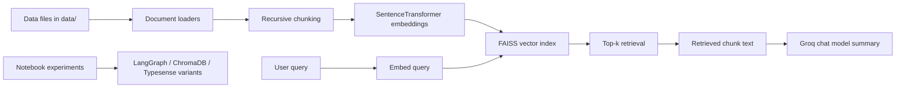

# ragpipe Project Walkthrough

This repository is a small retrieval-augmented generation (RAG) playground built around LangChain, SentenceTransformers, FAISS, Groq, ChromaDB experiments, and Typesense experiments. The actual production-like code lives under `src/`, while the notebooks in `agenticrag/` and `notebook/` are exploratory prototypes that demonstrate alternate RAG approaches.

This document is based on the code and workspace artifacts currently present in the repository.

## What This Project Is

At its core, the project does three things:

1. Load documents from the `data/` directory.
2. Split those documents into chunks and embed them with a sentence-transformer model.
3. Store and query the chunks through a vector database, then optionally summarize retrieved content with a Groq chat model.

There are also notebook-based experiments that show related workflows using LangGraph, ChromaDB, and Typesense.

## High-Level Architecture

The main code path is a local FAISS-backed RAG pipeline. The notebooks explore the same idea with different tools and data sources.

## Repository Layout

### Top-level files

- `main.py` is a minimal placeholder entry point that only prints a greeting.
- `app.py` is the main runnable demo for the local FAISS RAG flow.
- `pyproject.toml` defines the project metadata and dependencies.
- `requirements.txt` lists the same ecosystem dependencies in a flatter format.
- `README.md` exists but is empty.

### Package code

- `src/data_loader.py` loads supported file types from `data/`.
- `src/embedding.py` chunks documents and creates embeddings.
- `src/vectorestore.py` builds, saves, loads, and queries a FAISS vector store.
- `src/search.py` ties the loader, vector store, and Groq summarizer together.

### Data and artifacts

- `data/text_files/` contains sample text content.
- `data/pdf/` contains one PDF file.
- `data/books.jsonl` contains book catalog records used by the Typesense notebook.
- `faiss_store/` contains persisted FAISS artifacts for the local RAG pipeline.
- `data/vector_store/` contains persisted ChromaDB artifacts from the notebook experiments.

### Notebook experiments

- `agenticrag/agenticrag.ipynb`
- `notebook/document.ipynb`
- `notebook/pdfloader.ipynb`
- `notebook/typesense.ipynb`

These notebooks are not packaged application code, but they show the evolution of the idea.

## Runtime Pipeline in `src/`

### 1. Document loading: `src/data_loader.py`

The `load_all_documents(data_dir: str)` function walks the supplied data directory recursively and tries to load several file types into LangChain document objects.

Supported patterns in the code:

- PDF files via `PyPDFLoader`
- TXT files via `TextLoader`
- CSV files via `CSVLoader`
- XLSX files via `UnstructuredExcelLoader`
- DOCX files via `Docx2txtLoader`
- JSON files via `JSONLoader`

Important behavior from the implementation:

- It resolves the provided directory path with `Path(data_dir).resolve()`.
- It searches recursively using `glob('**/*.ext')` for each supported extension.
- It logs counts and file names as it goes.
- Each file is loaded independently inside a `try/except`, so one bad file does not stop the whole ingestion pass.
- All loaded LangChain documents are appended to a single list and returned.

Important limitation:

- The loader searches for `*.json`, not `*.jsonl`.
- The repository contains `data/books.jsonl`, so that file is not picked up by the current loader even though the project has a JSONL book dataset.

### 2. Chunking and embedding: `src/embedding.py`

`EmbeddingPipeline` handles two jobs:

- Splitting documents into chunks.
- Turning chunk text into dense vector embeddings.

Key implementation details:

- The default embedding model is `all-MiniLM-L6-v2`.
- The default chunk size is `1000` characters.
- The default chunk overlap is `200` characters.
- Chunking uses `RecursiveCharacterTextSplitter` with separators in this order: double newline, newline, space, then character fallback.
- Embeddings are produced by `SentenceTransformer.encode(...)`.
- The code returns a NumPy array of embeddings.

The chunking strategy is important because the vector store is built from chunks, not whole documents. That means the retrieval layer is searching smaller passages rather than entire source files.

### 3. Vector storage: `src/vectorestore.py`

`FaissVectorStore` is the local persistence layer for the main RAG flow.

What it does:

- Creates a persistence directory if it does not exist.
- Loads a SentenceTransformer model for query embeddings.
- Builds a FAISS `IndexFlatL2` index.
- Stores chunk text in a parallel Python `metadata` list.
- Saves the index to `faiss_store/faiss.index`.
- Saves the metadata list to `faiss_store/metadata.pkl`.

How indexing works:

1. `build_from_documents(...)` creates an `EmbeddingPipeline`.
2. Documents are chunked.
3. Chunk embeddings are generated.
4. Metadata is created as a list of dictionaries, each containing the chunk text under the `text` key.
5. `add_embeddings(...)` initializes the FAISS index if needed and adds the vectors.
6. `save()` writes both the index and metadata to disk.

How querying works:

- `query(query_text, top_k)` embeds the query text with the same SentenceTransformer model.
- `search(query_embedding, top_k)` asks FAISS for nearest neighbors.
- The search result is returned as a list of dictionaries containing the index, distance, and metadata.

Implementation detail worth noting:

- The store uses L2 distance, not cosine similarity.
- No vector normalization is performed in this code.
- The metadata list stores only the chunk text, not source file names or richer provenance.

### 4. Retrieval and summarization: `src/search.py`

`RAGSearch` is the main orchestration class for the local demo.

Behavior on initialization:

- Loads environment variables from `.env` with `load_dotenv()`.
- Creates a `FaissVectorStore`.
- Checks whether `faiss_store/faiss.index` and `faiss_store/metadata.pkl` already exist.
- If they do not exist, it loads documents from `data/` and builds the vector store.
- If they do exist, it loads the saved FAISS store from disk.
- It tries to create a Groq chat model if `GROQ_API_KEY` is set and `langchain_groq` is available.
- If Groq is unavailable, summarization is disabled and a warning is printed.

The main method is `search_and_summarize(query, top_k=5)`:

1. It queries the vector store for the top matching chunks.
2. It pulls the `text` field out of the returned metadata.
3. It joins the matched chunk texts into a context string.
4. If no context is found, it returns a fallback message.
5. If no Groq model is available, it returns a fallback message.
6. Otherwise, it sends a summarization prompt to the chat model and returns the model response.

The prompt it sends is built from the retrieved context and the user query, so the LLM is summarizing retrieved passages rather than answering from memory alone.

## How the Top-Level Scripts Behave

### `main.py`

This file is just a placeholder:

- It defines `main()`.
- `main()` prints `Hello from ragpipe!`.
- There is no RAG logic here.

### `app.py`

This is the runnable example for the local FAISS RAG flow.

The current script does the following:

1. Imports `load_all_documents`, `FaissVectorStore`, and `RAGSearch`.
2. Leaves an older vector-store build example commented out.
3. Instantiates `RAGSearch()`.
4. Uses the fixed query `What is attention mechanism?`.
5. Calls `search_and_summarize(query, top_k=3)`.
6. Prints the summary.

That means `app.py` is a thin demo wrapper, not a general CLI.

## Data Files and What They Contain

### `data/text_files/python_intro.txt`

This file is a short introduction to Python programming. It describes Python as a high-level, interpreted language and lists basic features like readability, standard library support, cross-platform compatibility, and common use cases.

### `data/text_files/machine_learning.txt`

This file introduces machine learning, explains major learning types, and lists example algorithms and applications.

### `data/books.jsonl`

This is a JSON Lines file with book records. Each line contains fields like:

- `title`
- `authors`
- `publication_year`
- `id`
- `average_rating`
- `image_url`
- `ratings_count`

The file is used in the Typesense notebook, not by the current `src/data_loader.py` pipeline.

### `data/pdf/2601.03329v1.pdf`

The repository contains one PDF file under `data/pdf/`. The project code is capable of loading PDFs, and the notebook experiments explicitly process PDFs.

## Persisted Artifacts Already in the Repo

### `faiss_store/`

The local RAG pipeline already has persisted vector-store artifacts:

- `faiss_store/faiss.index`
- `faiss_store/metadata.pkl`

The current stored index contains 138 vectors and 138 metadata entries.

That means the FAISS-backed flow has already been built at least once and saved to disk.

### `data/vector_store/`

The notebook work created a persisted ChromaDB store under `data/vector_store/`.

This is separate from the FAISS store and belongs to the notebook experiments rather than the `src/` package flow.

## Notebook Walkthroughs

The notebooks matter because they show how the project evolved and what alternate paths were tried.

### `agenticrag/agenticrag.ipynb`

This notebook is titled "Agentic RAG With LangGraph" and demonstrates a graph-based RAG flow.

The notebook does the following:

- Imports `StateGraph` and `END` from LangGraph.
- Loads `ChatGroq` for generation.
- Uses `HuggingFaceEmbeddings` and a LangChain FAISS vector store.
- Defines a `TypedDict` state with `question`, `documents`, `answer`, and `needs_retrieval`.
- Creates sample in-memory documents about LangGraph, RAG, vector databases, and agentic systems.
- Builds a retriever from the sample documents.
- Defines `decide_retrieval(state)` as a keyword heuristic.
- Defines `retrieve_documents(state)` to invoke the retriever.
- Defines `generate_answer(state)` to build a prompt and ask the LLM.
- Defines `should_retrieve(state)` as a conditional branch helper.
- Builds the LangGraph workflow with `decide -> retrieve/generate -> END`.
- Wraps the graph in `ask_question(question)`.
- Tests the flow with several sample questions.

Important code issue visible in the notebook:

- The `generate_answer` cell appears malformed.
- The indentation is broken around the `if state["needs_retrieval"]:` block.
- The function also references `documents` without assigning it from `state`.
- As written, that cell is not reliable and would need correction before use.

### `notebook/document.ipynb`

This notebook is about data ingestion and a ChromaDB-based RAG pipeline.

What it demonstrates:

- Creating LangChain `Document` objects manually.
- Writing sample text files for testing.
- Loading a text file with `TextLoader`.
- Loading a directory of text files with `DirectoryLoader`.
- Loading PDFs with `PyMuPDFLoader`.
- Inspecting document types.
- Splitting documents into chunks with `RecursiveCharacterTextSplitter`.
- Building embeddings with `SentenceTransformer`.
- Creating and persisting a ChromaDB vector store.
- Querying the vector store with a custom retriever class.
- Building simple and advanced RAG helper functions.

This notebook also adds metadata such as source file name, file type, document index, and content length. That is richer provenance than the main `src/` FAISS pipeline stores today.

### `notebook/pdfloader.ipynb`

This notebook focuses on PDF ingestion and a ChromaDB-backed pipeline.

What it demonstrates:

- Loading all PDFs from a directory recursively.
- Adding file metadata such as `source_file` and `file_type`.
- Splitting PDFs into chunks.
- Using an `EmbeddingManager` wrapper around `SentenceTransformer`.
- Creating a persistent vector store with cosine distance in ChromaDB.
- Adding documents and embeddings to the collection.
- Running similarity queries.
- Building a `RAGRetriever` class that computes similarity scores and filters by threshold.
- Wiring retrieval into a simple RAG prompt with Groq.
- Returning an advanced RAG output with answer, sources, confidence, and optional context.

This notebook is more feature-rich than the main `src/` code and includes explicit source reporting and confidence scoring.

### `notebook/typesense.ipynb`

This notebook explores cloud vector/search workflows using Typesense.

What it does:

- Reads `TYPESENSE_HOST` and `TYPESENSE_API_KEY` from the environment.
- Creates a Typesense client.
- Defines a `books` schema with facets and a default sorting field.
- Imports the JSONL book data from `data/books.jsonl`.
- Runs a Typesense search for `Harry Potter`.
- Shows a LangChain + Typesense + Groq RAG-style integration.
- Builds a `Typesense.from_documents(...)` doc search object.
- Demonstrates similarity search and retriever invocation.

This notebook is the only place in the repository where `books.jsonl` is clearly used.

## Dependencies and Runtime Expectations

The project targets Python `>=3.12`.

The declared dependencies include:

- LangChain core libraries
- `langchain-community`
- `langchain-groq`
- `langchain-openai`
- `langgraph`
- `langchain-text-splitters`
- `sentence-transformers`
- `faiss-cpu`
- `chromadb`
- `typesense`
- `pypdf`
- `pymupdf`
- `python-dotenv`
- `ipykernel`

The two environment variables that matter in the notebook and RAG code are:

- `GROQ_API_KEY`
- `TYPESENSE_HOST` / `TYPESENSE_API_KEY` for the Typesense notebook

## End-to-End Behavior of the Main FAISS RAG Flow

Here is the actual sequence implemented by `src/search.py` and `app.py`:

1. Start `RAGSearch`.
2. If the FAISS files are missing, load supported documents from `data/` and build the index.
3. Chunk all loaded documents.
4. Embed each chunk with `all-MiniLM-L6-v2`.
5. Save embeddings in `faiss_store/faiss.index` and text metadata in `faiss_store/metadata.pkl`.
6. For a query, embed the query with the same model.
7. Retrieve the closest chunks from FAISS.
8. Join the retrieved chunk text into a context block.
9. If Groq is configured, ask the LLM to summarize the context for the query.
10. Print the resulting summary.

## Observed Gaps and Caveats

These are not guesses; they follow directly from the code that is present.

- `README.md` is empty, so the repository currently lacks official documentation outside this generated file.
- `main.py` is only a greeting placeholder and does not run the RAG pipeline.
- `app.py` uses a hard-coded demo query instead of accepting user input.
- `src/data_loader.py` does not load `.jsonl`, so `data/books.jsonl` is excluded from the main FAISS pipeline.
- `FaissVectorStore` stores only chunk text in metadata, so provenance is limited compared with the notebook experiments.
- The FAISS implementation uses L2 distance and does not normalize vectors.
- The agentic notebook contains a visibly broken `generate_answer` cell and should not be treated as production-ready code.

## Practical Summary

This repository is best understood as a RAG lab with one main local pipeline and several notebook experiments:

- The main package under `src/` implements a local FAISS-based retrieval and Groq summarization flow.
- The notebooks show earlier or alternative experiments using LangGraph, ChromaDB, and Typesense.
- The workspace already contains built vector-store artifacts, so the main pipeline has been run before.

If you want to extend the project, the most obvious next steps are to make the loader include `.jsonl`, expose a real CLI instead of a fixed demo query, and turn the notebook experiments into documented, reusable modules.